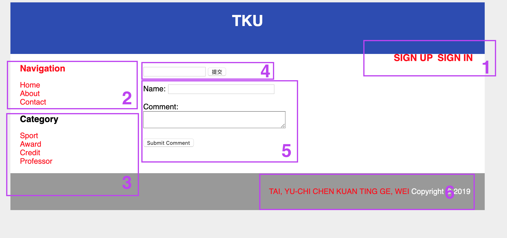

# Group 2
## Group 2 Members:
`/yuchi.txt`
This is yuchi introduction 
`/KungTing.txt`
This is KungTing introduction 
`/wei.txt`
This si Wei introduction 

## Our Purpose:
[Goal](/ProjectGoal)this file contain all the detail of our project goal 
`我們想要做出一個論壇是關於淡江大學的，我們的理想是：(1)有註冊登入系統 (2)在主頁上可以寫下文章心得的功能 (3)在文章裡面提供留言的功能
(4)在主頁上有文章的分類 (5)有我們的基本自我介紹以及專題介紹連結
`
`實際上我們做出來：(1)登入系統做出來了，可以連結到db，但還沒做出後續的功能;註冊系統也還沒完成。 (2)在主頁上可以寫下文章，但還沒解決儲存問題。
(3)留言功能還沒有時間開發。 (4)在旁邊有做出簡單分類，但因為網頁中還沒有任何的文章，不能做分類。(5)專題以及自我介紹有連結
`
## demo

1. 是我們的登入註冊的區塊，點擊關鍵字就可以進入了
2. 是我們的超連結，可以進入相對應的區域
3. 分類區，文章的分類，依分類找到自己所喜歡的文章
4. search bar可以搜尋關鍵字找到文章的地方
5. 從至框框中輸入妳想新增的文章
6. 我們的project proposal 以及個人自我介紹

